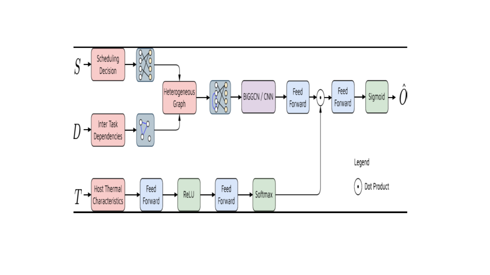

<h1 align="center">HunterPlus: AI based energy-efficient task scheduling for cloud–fog computing environments</h1>

## Abstract
Cloud computing is a mainstay of modern technology, offering cost-effective and scalable solutions to a variety of different problems. The massive shift of organization resource needs from local systems to cloud-based systems has greatly increased the costs incurred by cloud providers in expanding, maintaining, and supplying server, storage, network, and processing hardware. Due to the large scale at which cloud providers operate, even small performance degradation issues can cause energy or resource usage costs to rise dramatically. One way in which cloud providers may improve cost reduction is by reducing energy consumption. The use of intelligent task-scheduling algorithms to allocate user-deployed jobs to servers can reduce the amount of energy consumed. Conventional task scheduling algorithms involve both heuristic and metaheuristic methods. Recently, the application of Artificial Intelligence (AI) to optimize task scheduling has seen significant progress, including the Gated Graph Convolution Network (GGCN). This paper proposes a new approach called HunterPlus which examine the effect of extending the GGCN’s Gated Recurrent Unit to a Bidirectional Gated Recurrent Unit. The paper also studies the utilization of Convolutional Neural Networks (CNNs) in optimizing cloud–fog task scheduling. Experimental results show that the CNN scheduler outperforms the GGCN-based models in both energy consumption per task and job completion rate metrics by at least 17 and 10.4 percent, respectively.


## Quick Start Guide
To run the COSCO framework, install required packages using
```bash
python3 install.py
```
To run the code with the required scheduler, modify line 106 of `main.py` to one of the several options including LRMMTR, RF, RL, RM, Random, RLRMMTR, TMCR, TMMR, TMMTR, GA, GOBI.
```python
scheduler = CNNScheduler('energy_latency_'+str(HOSTS))
```

To run the simulator, use the following command
```bash
python3 main.py
```

## Description

```
The GGCN, BiGGCN, and CNN Models are all located in \scheduler\BaGTI\src\models.py
They are known as GRU128, BiGRU128, and CNN

scheduler\BaGTI\src\gnn.py has the backward gated unit.
scheduler\BaGTI\src\opt.py has the optimization function for CNN.

The schedulers are CNN_Normalised and GOBI.
```

## Links

| **Paper** : https://www.sciencedirect.com/science/article/pii/S2542660522001482 |
| **Contact**: s.iftikhar@qmul.ac.uk |

## Cite this work
Our work is published in Internet of Things journal. Cite using the following bibtex entry.
```bibtex
@article{iftikhar2023hunterplus,
  title={HunterPlus: AI based energy-efficient task scheduling for cloud--fog computing environments},
  author={Iftikhar, Sundas and Ahmad, Mirza Mohammad Mufleh and Tuli, Shreshth and Chowdhury, Deepraj and Xu, Minxian and Gill, Sukhpal Singh and Uhlig, Steve},
  journal={Internet of Things},
  volume={21},
  pages={100667},
  year={2023},
  publisher={Elsevier}
}
```
